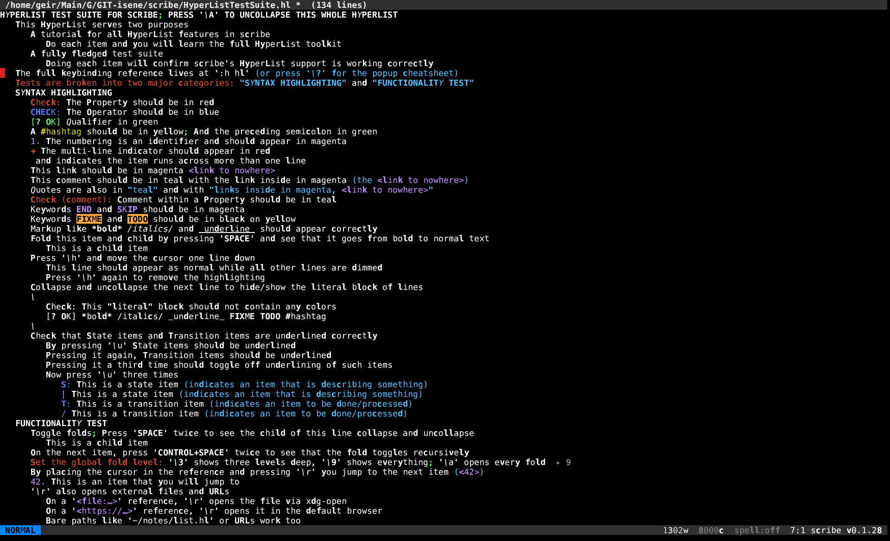
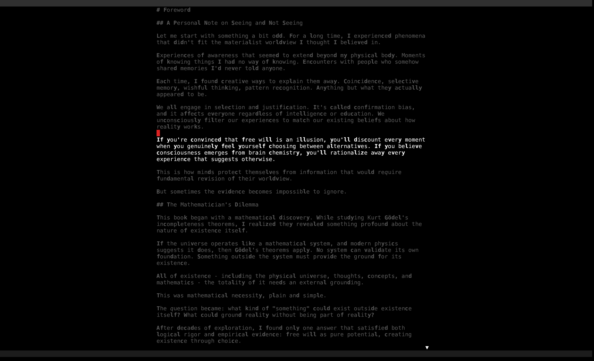
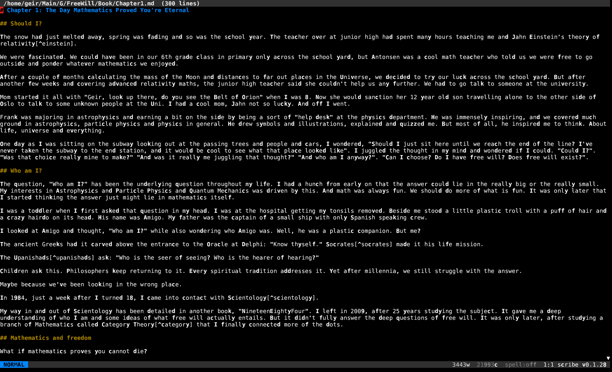

# Scribe — Modal Text Editor for Writers


   

Vim-flavoured modal editor with the parts a writer actually needs and a few features vim never had. Single static binary, sub-10 ms startup, soft-wrap by default, **Claude Code in the editor**, syntax highlighting, hunspell spellcheck, Goyo-style reading mode, persistent registers shared across sessions.

Part of the [Fe₂O₃ Rust terminal suite](https://github.com/isene/fe2o3). Built on [crust](https://github.com/isene/crust) and [highlight](https://github.com/isene/highlight).

<br clear="left"/>

## Why scribe (and not vim)

Vim has a thousand features. A writer needs about thirty of them. Scribe is "vim minus 90 % minus the programming subsystem, plus a handful of writer-first niceties":

- **Modal core** — `hjkl`, motions, operators, text-objects, registers, marks, macros, dot-repeat, undo tree.
- **Soft-wrap by default** — long prose lines wrap at the pane edge with a continuation indicator. Live resize via `SIGWINCH`.
- **Claude integration in the prompt** — `:claude {prompt}` runs `claude -p` over your selection / paragraph / buffer and splices the response back. One `u` reverses an entire turn. `:chat` for full interactive sessions.
- **Reading mode** — `:read` (or `zr`) for Goyo-style centered text, optional Limelight-style paragraph dim. Prose without chrome.
- **Email-mode rendering** — `.eml` files and kastrup compose tempfiles get header / quote-level / signature colors that match kastrup's right pane 1-for-1. Inline email addresses + URLs highlighted everywhere.
- **Syntax highlighting** for ~18 source languages plus dedicated HyperList / Markdown / LaTeX renderers via the shared `highlight` crate. Multi-line block comments and string literals keep their color across line breaks.
- **Inline colour, font + office export** — `\C` colours a Visual selection (prism picks fg/bg) and `\F` sets its font + size (the `fonts` picker), both stored as live HTML spans; `\M` conceals the span markup (revealing it only on the cursor's line) so styled prose reads clean. `\xd` / `\xo` export the buffer to **docx** / **odt** via LibreOffice with colour, highlight, font and size preserved. The styling lives in the text, so a Markdown / HTML / plain save keeps it.
- **Spellcheck** via hunspell — auto-on for email mode, opt-in elsewhere via `:set spell`. Configurable language and underline color. `]s` / `[s` navigation, `z=` suggestions, `zg` to add to personal dict.
- **Persistent registers** — yanks and macros live in `~/.config/scribe/registers.json` and update on every yank, so they survive restarts AND share live across concurrent scribe sessions.
- **No LSP / debugger / quickfix / `:make`** — writers don't compile.
- **Block paste that actually pastes a block** — `Ctrl-v` selection lays each row at the same column on consecutive lines. One `u` reverses the whole thing.

## Status

**v0.1.63** — daily-driveable for prose AND HyperList. Inline colour / font / markup-conceal and office export are in. Full feature reference below.

## Screenshots

**HyperList editing** — full hyperlist.vim parity with the new `\`-grouped keymap. Syntax highlighting tracks the spec: red Properties, blue Operators, green Qualifiers, magenta References, teal Comments / Quotes, yellow Hashtags, multi-line `+` markers, underlined State/Transition items.



**Reading mode + Limelight** — `:read` (or `zr`) for distraction-free prose, `:set pdim` to dim every paragraph except the cursor's. Header collapses, gutter hides, focus follows you.



**Long-form Markdown** — soft-wrap by default, syntax highlighting, sub-10 ms startup. The same modal core that powers HyperList editing handles prose, code, email, and source.




## Reference

### Motion

| Keys | Action |
|---|---|
| `h j k l` (also arrows) | left / down / up / right; arrows wrap across line boundaries in Insert |
| `0` `^` `$` | line start / first non-blank / line end |
| `gg` `G` (also `HOME` `END`; count: `12G`) | first / last line / line N |
| `w b e W B` | next/prev word, end of word; capital = WORD (whitespace-delimited) |
| `f{c}` `F{c}` `t{c}` `T{c}` | jump on/before next/prev `c` on the current line |
| `Ctrl-D` `Ctrl-U` (`PgUp/PgDn`) | half-page / full-page scroll |
| `n` `N` | next / prev search match |
| `*` `#` | search forward / backward for word under cursor |
| Counts | prefix any motion: `5j`, `12G`, `3w` |

### Insert

| Keys | Action |
|---|---|
| `i` `a` | insert before / after cursor |
| `I` `A` | insert at line start / end |
| `o` `O` | open new line below / above |
| `s` `S` | substitute char (`s`) or line (`S`) and enter Insert |
| Arrows + HOME/END | work in Insert too |
| `Ctrl-Y` | insert character from the same column on the line above |
| `Ctrl-E` | insert character from the same column on the line below |
| Bracketed paste | the entire pasted blob is a single undo node — instant on big pastes |

### Operators + motion

`d c y > < gq` over any motion or text-object. Examples: `5dw`, `d3w`, `cgg`, `yG`, `c$`, `>ap`, `gqap`. Linewise doubling: `dd cc yy >> << gqq`. Linewise shortcuts: `D C Y` (delete / change / yank to end of line). All record `last_change` for `.` repeat.

### Text objects

`iw aw` `i" a"` `i' a'` `` i` a` `` `i( a(` `i[ a[` `i{ a{` `i< a<` `ip ap`. Aliases: `ib`/`iB` for `()` / `{}`. Use after any operator: `ci"`, `dap`, `>i{`.

### Edit primitives

| Keys | Action |
|---|---|
| `x` `X` | delete char forward / backward |
| `r{c}` | replace char under cursor with `c` |
| `J` | join with line below |
| `~` | toggle case under cursor |
| `p` `P` | paste after / before |
| `Ctrl-A` `Ctrl-X` | increment / decrement number under cursor — supports ISO 8601 dates `YYYY-MM-DD` with month-end / leap-year rollover (`2024-02-28` + 1 = `2024-02-29`; `2025-02-28` + 1 = `2025-03-01`). Counts work (`30 Ctrl-A`). Zero-padding preserved on integers. |
| `Ctrl-Up` `Ctrl-Down` | swap current line with the one above / below. Counts work (`5 Ctrl-Down`). One compound undo node per swap. |
| `.` | dot-repeat — replays the last change (operator + motion + inserted text, replace, paste, increment, line move) |

### Visual modes

`v` charwise, `V` linewise, `Ctrl-v` block. Operate with any operator. **Live selection stats** in the status line: `sel: 3l 47w 230c` updates as you extend.

### Registers

| Slot | Use |
|---|---|
| `"a` … `"z`, `"0`-`"9` | named slots; `"ay$` yanks into `a` |
| `""` | unnamed (last yank/delete; default for `p`/`P`) |
| `"0` | last yank only (delete doesn't touch it) |
| `"+` `"*` | system clipboard via OSC 52 |

**Persistent.** Named slots are written to `~/.config/scribe/registers.json` on every yank / cut. They survive restarts AND share live across concurrent scribe sessions: yank in scribe A, `"ap` in scribe B without going through the OS clipboard. The system-clipboard slots (`"+`, `"*`) are not persisted.

**Yank/cut feedback.** Status line confirms every register write: `5 lines yanked`, `23 chars yanked into "a`, `3 lines deleted`. Yank green, cut/change orange.

**Inspector.** `:reg` (also `:registers`) opens a popup showing every set register with kind tag (c/l/b) and a 60-char preview. `\n` rendered literally so multiline yanks and macros stay one row. ESC closes.

### Search + substitute

| Pattern | Action |
|---|---|
| `/pat` `?pat` | regex forward / backward |
| `n` `N` | next / prev |
| `* #` | jump on word under cursor |
| `:s/pat/rep/[gi]` | substitute on current line |
| `:%s/pat/rep/[gi]` | substitute on whole buffer (one undo node) |

### Undo

`u` undo, `Ctrl-R` redo. The buffer keeps an undo **tree** in memory (not a linear stack), and the cursor follows the edit site so you can see what changed.

### Macros

`M{reg}` starts recording into register `reg`; `M` again stops. `@{reg}` replays. `@@` replays the last-played macro. Macros and yanks **share the same registers**, so:

- `Ma`, type some keys, `M` — recorded.
- `"ap` pastes the captured key sequence as readable text (`<Esc>`, `<C-Up>`, `<CR>`, …).
- Edit the pasted text, select it, yank it back into a register: `"ay$` (or any yank).
- `@a` now replays the edited sequence.

`m` is left free for marks. Recursion is bounded at depth 4.

### Marks

`m{a-z}` sets a mark at the cursor's byte offset. Jump back with:

- `'a` — first non-blank of the line containing mark `a`.
- `` `a `` — exact column.

Marks are session-local (not persisted).

### Spellcheck

| Command / key | Action |
|---|---|
| `:set spell` / `:set nospell` | toggle |
| `:set spelllang=NAME` (or `:set lang=NAME`) | switch dictionary (`en_US`, `nb_NO`, `nn_NO`, `de_DE`, …); drops + re-spawns hunspell |
| `:set spellcolor=N` (rcfile only) | xterm-256 palette index for the underline / text color |
| `]s` / `zn` | next misspelling |
| `[s` / `zp` | previous misspelling |
| `z=` | suggestions (numbered list, type number to pick) |
| `zg` | add word at cursor to personal dict (`~/.config/scribe/spell.add`) |

Auto-on for `.eml` and kastrup compose tempfiles. Visual: misspelled words rendered in the spell color (default 196 / red) with a curly underline where supported (kitty, wezterm); on terminals that don't support extended-SGR underline color, the colored text alone makes the spelling signal clear.

### Reading mode

For long-form prose. Distraction-free rendering, optionally Goyo-style.

| Command / key | Action |
|---|---|
| `:read` / `zr` | toggle reading mode |
| `:noread` | exit |
| `:set readingwidth=80` (or `rw=80`) | centered text column width; 0 = full pane |
| `:set paragraphdim` (or `pdim`) | Limelight-style dim of every paragraph except the cursor's |
| `:set nopdim` | turn dim off |

Header collapses to a thin dim divider, footer hides except for transient status, line numbers force-off. With `paragraphdim`, source-mode syntax colors are dropped on dimmed lines so the dim is uniform.

Suggested rcfile combo:

```
read = true
readingwidth = 80
paragraphdim = true
```

### Auto-wrap

`:set textwidth=72` (or `:set tw=72`) — typing a space past column 72 breaks the line at the last preceding whitespace. `:set tw=0` disables. Preserves leading indent. No-ops when no break point exists (one giant word).

### Themes + syntax

| Command | Action |
|---|---|
| `:set theme=NAME` | `monokai` / `solarized` / `nord` / `dracula` / `gruvbox` / `plain` |
| `--theme=NAME` (CLI) | one-session override |
| `:set syntax=NAME` (vim aliases `:set ft=` / `:set filetype=`) | force the buffer's filetype: `plain` / `email` / `rust` / `md` / `html` / `py` / `sh` / `js` / `ts` / `c` / `cpp` / `go` / `rb` / `lua` / `tex` / `hl` (HyperList) / … |

Source highlight handles **multi-line state**: block comments and string literals keep their color across line breaks. Email mode mirrors kastrup's right-pane palette 1-for-1.

### Inline colour, font + markup

Per-span styling is stored as inline HTML, so it lives in the text (a Markdown / HTML / plain save keeps it) and exports to office formats with the styling intact.

| Key | Action |
|---|---|
| `\C` | colour the Visual selection — [prism](https://github.com/isene/prism) picks fg/bg → `<span style="color:…">` |
| `\F` | set its font — the [fonts](https://github.com/isene/fonts) picker chooses the family, then scribe asks for a point size (Enter = none) → `<span style="font-family:'…'[;font-size:…pt]">` |
| `\M` | hide the span markup — tags conceal on every line except the cursor's, so styled prose reads clean but stays editable where the cursor sits |
| `\xd` / `\xo` | export to **docx** / **odt** via LibreOffice headless, with colour, background, font and size preserved |

The styled inner text renders live (colour applied, `<span>` tags dimmed) in Markdown, HTML, and plain-text buffers alike. `\C` / `\F` each launch their picker full-screen, then return to scribe with the choice wrapped around the selection.

### Line numbers + gutter

| Command | Action |
|---|---|
| `:set number` (`:set nu`) | absolute line numbers |
| `:set relativenumber` (`:set rnu`) | distance from cursor (cursor line stays absolute) |
| `:set nonumber` (`:set nonu`) | gutter off |

### Configuration popup

`:config` opens a modal popup for on-the-fly preferences:

- `t` cycle theme
- `n` toggle line numbers
- `r` toggle relative numbers
- `s` toggle spell on/off
- `l` prompt for spell language
- `c` prompt for spell color (0–255)
- `W` save current settings to `~/.config/scribe/scriberc` (preserves comments and unknown keys)
- `ESC` close

### Help

- `\?` / `g?` — **searchable help index**: a live-filtered list of every binding, command, and feature. Type to filter (matches across key, description, and category), `↑↓` / `PgUp`-`PgDn` scroll, `Esc` closes.
- `:help <query>` — open the index pre-filtered, e.g. `:help font`, `:help export`, `:help :set`, `:help fold`.
- `:help` / `:help hl` — open the full bundled README / HyperList reference in a popup; scroll with `j` / `k`, `Esc` closes.

### Sessions

Cursor position + scroll for every file you edit are saved to `~/.config/scribe/sessions.json` on quit and restored next time you open the same path. CLI `+N` overrides the saved position. The store is capped at 200 entries.

### Custom keymaps

Drop a `[keymap]` section into scriberc to define your own bindings. Format per line: `MODE LHS RHS`.

```
[keymap]
normal  zr  :read
normal  zz  :wq
insert  jk  <Esc>
normal  qq  :q!
```

- `MODE` is `normal`, `insert`, or `visual`.
- `LHS` is 1- or 2-key — single chars or vim-style escapes (`<Esc>`, `<C-Space>`, `<CR>`, `<C-Up>`).
- `RHS` starting with `:` runs as an ex command. Anything else is fed back through the input layer as if you typed it.

User maps take precedence over scribe's built-in `zr`/`zz`/`zn`/`zp` shortcuts (which stay as defaults if you don't define your own).

### Quick keys (Z prefix)

| Keys | Action |
|---|---|
| `zr` | toggle reading mode |
| `zz` | save + quit (= `:wq`) |
| `zn` | next misspelling |
| `zp` | previous misspelling |
| `z=` | spell suggestions |
| `zg` | add word to dict |

### Command history

Up / Down at the `:` prompt recalls past commands. Persisted in `~/.config/scribe/cmdhistory` (capped at 100).

### Status line

Always shows:

- Mode badge (NORMAL / INSERT / VISUAL / …)
- Transient status messages or `:` cmdline
- Word + char count (full buffer normally, **selection live in Visual**)
- `spell:LANG` (green when on) / `spell:off` (grey)
- `line:col` position
- `scribe vN.N.N`

### Quit semantics

| Key / command | Behavior |
|---|---|
| `q` | quit when buffer is clean; refuses + warns if dirty |
| `Q` | quit, **discard** unsaved changes |
| `zz` / `:wq` / `:x` | save + quit |
| `:q!` | quit without saving |

Every save first writes `<path>.scribe-bak` so an accidental `:wq` after a destructive `:claude` is recoverable.

### Error log

On a panic, scribe restores the terminal, writes a timestamped backtrace to `~/.config/scribe/scribe.log`, and prints a one-line summary to stderr. `RUST_BACKTRACE=1` is set automatically (unless you've set `=0` yourself).

## Claude Code integration

`:claude` runs `claude -p` with your text on stdin and splices the response back. The scoping is deliberately conservative — whole-buffer replacement requires an explicit selection so a stray prompt can't silently destroy your file:

```
:claude rewrite this paragraph in plainer English
   → with a Visual selection: replace the selection with the response
   → without selection:        replace the CURRENT PARAGRAPH (text-object `ap`)

:claude what's a tighter version of this?
   → same scoping rules: selection > current paragraph

:claude grammar
   → shorthand: "Fix grammar, spelling, punctuation. Preserve meaning + tone."

:claude tighten
   → shorthand: "Rewrite to be more concise."

:claude plain
   → shorthand: "Rewrite in plainer English."

:claude continue
   → input = buffer up to cursor; INSERT response at cursor (no replace)
```

To rewrite the **whole buffer**, select it first: `ggVG:claude …`.

The whole turn is one compound undo node, so `u` reverses the change in one step. The status line shows ` claude: NNN chars  (u to undo)` after a successful turn.

If Claude has rewritten code into prose (or vice versa) and the highlighter looks wrong, swap it with `:set syntax=plain` / `:set syntax=markdown` / `:set syntax=rust`.

### Full Claude Code session — `:chat`

For multi-turn discussion, `:chat` suspends scribe and opens a regular interactive Claude Code session in the same terminal. The current buffer (including unsaved edits) is snapshotted to `/tmp/scribe-chat-<pid>.txt`:

```
:chat
   → scribe yields the terminal; you're in `claude` interactively.
   → ask anything, paste excerpts, iterate. The buffer's tempfile path
     is in claude's first message — read it via /file or just ask claude
     to read it.
   → /exit (or claude's normal quit) returns you to scribe, buffer
     untouched.
```

Use `:claude {prompt}` for surgical one-shot edits where you want the response spliced back; use `:chat` when you want a real conversation.

Requires `claude` on `PATH` (both commands).

## Configuration

`~/.config/scribe/scriberc` — simple `key = value` per line, `#` comments. Full key reference:

```
# Appearance
theme = dracula              # monokai | solarized | nord | dracula | gruvbox | plain
number = false               # absolute line numbers in the gutter
relativenumber = false       # relative line numbers (forces number=true)

# Spell
spell = false                # auto-on (email is always on regardless)
lang = en_US                 # hunspell dict tag (en_US, nb_NO, nn_NO, de_DE, …)
spellcolor = 196             # xterm-256 palette index for the spell color

# Reading
read = false                 # enter reading mode at startup
readingwidth = 80            # centered column width (0 = full pane)
paragraphdim = true          # Limelight-style dim of non-current paragraphs
```

`--theme NAME` overrides the rcfile for one session. Runtime `:set` commands stay in-session — the rcfile is the hand-edited source of truth, except for the `W` key in `:config` which writes managed keys back while preserving comments.

## Files / locations

| Path | Contents |
|---|---|
| `~/.config/scribe/scriberc` | persistent settings |
| `~/.config/scribe/cmdhistory` | `:` command history (capped at 100) |
| `~/.config/scribe/registers.json` | persisted yank/macro registers |
| `~/.config/scribe/sessions.json` | per-file cursor + scroll positions |
| `~/.config/scribe/spell.add` | personal dictionary for `zg` |
| `~/.config/scribe/scribe.log` | error log (panics + backtraces) |
| `<file>.scribe-bak` | one-step backup written before every save |
| `/tmp/scribe-chat-<pid>.txt` | buffer snapshot during `:chat` |

## Install

```bash
git clone https://github.com/isene/scribe
cd scribe
PATH="/usr/bin:$PATH" cargo build --release
ln -sf "$PWD/target/release/scribe" ~/bin/scribe
```

Or grab the binary from the [latest release](https://github.com/isene/scribe/releases/latest).

## Use as `$EDITOR`

```bash
export EDITOR=scribe
```

Scribe accepts `+N` for line-jump (vim convention), so kastrup's compose flow drops the cursor straight on the body.

## HyperList

Scribe ships with full `hyperlist.vim` parity for `.hl` and `.woim` files: indent folding, autonumbering, encryption (dotfile auto-encrypt, reading both the Ruby `hyperlist` app's `ENC:` envelope and the vim plugin's `openssl aes-256-cbc -pbkdf2 -salt` form, and preserving whichever a file uses on save), references, presentation mode, calendar export, HTML / LaTeX / Markdown export, and more.

All HyperList commands live behind the `\` leader. Highlights:

| Group | Keys |
|---|---|
| Folding | `\0`..`\9` level · `\a` open all · `<SPACE>` / `<C-SPACE>` toggle |
| Items   | `\v` checkbox · `\V` +stamp · `\o` in-progress · `\n` autonumber |
| Nav     | `\r` reference jump (in-buffer / file / URL) · `\p` presentation toggle |
| Filter  | `\S` / `\H` / `\N` show / hide / reset (also `zs` / `zh` / `z0`) |
| Look    | `\h` limelight · `\u` state/transition underline |
| Export  | `\xh` HTML · `\xl` LaTeX · `\xm` Markdown · `\xp` PDF · `\xd` docx · `\xo` odt |
| Crypto  | `\ee` encrypt · `\ed` decrypt · `\ek` rekey |
| Colour  | `\C` colour the Visual selection (prism picks fg/bg) |
| Other   | `\s` sort · `\c` complexity · `\g` calendar add |
| Help    | `\?` cheatsheet popup (ESC dismisses) |

Run scribe on the bundled [`HyperListTestSuite.hl`](HyperListTestSuite.hl) to learn (and verify) every feature interactively. Full reference: [HYPERLIST.md](HYPERLIST.md) or `:h hl` inside scribe.

## Roadmap

- HyperList Tab fold/unfold via Tab key (currently SPACE) — minor ergonomics tweak.
- **General `:map` system** — user-defined keymaps in scriberc instead of hardcoded built-ins.
- **`:earlier 5m`** — time-based undo navigation.

## Philosophy

A writer's editor. Not a programmer's editor. Not an "everything" editor. Built specifically because every other editor is bloated with features for a job the user doesn't have — and is missing the one feature a writer in 2026 actually wants: AI in the loop without leaving the buffer.

## License

Public domain ([Unlicense](https://unlicense.org/)).
